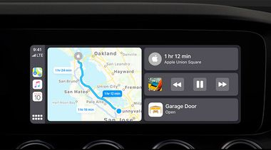
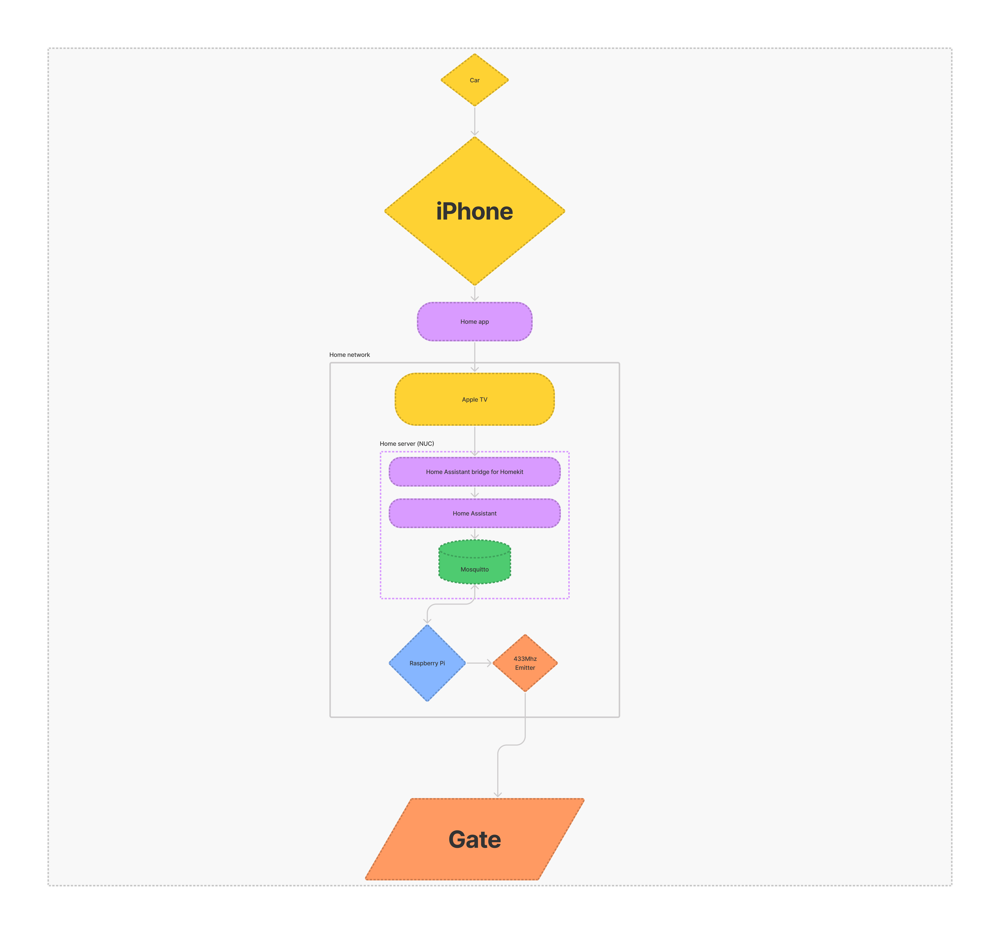
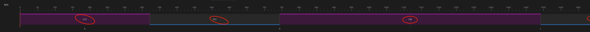
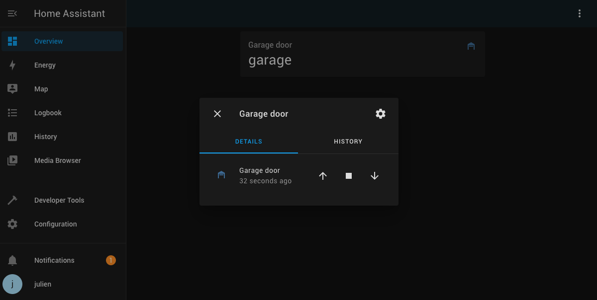

# Automate opening your garage door / gate

## Summary

This project sums up how I automated opening my garage door using a Raspberry PI, a 433Mhz emitter, Home Assistant, and Homekit.

## Introduction

I have a car and I use Apple Carplay.
I wanted to automate my garage door so that I could have the "Garage door" button on the screen in my car. 😍



Obviously I couldn't change the hardware, I'm just a tenant, but the door could already be opened remotely, so I figured I could just copy the signal it was sending, and send it back.

Note that my garage door uses a very simple system, and that my process may not work for your garage.

I did it. Took me some time to understand how to do just that, but hopefully this document will help people trying to achieve the same thing.

Here's a graph of my setup, you can have something simpler, but I already had a home server (NUC) so I setup some things on that instead than on the Raspberry PI.  
My setup requires the Raspberry PI to be connected to your local network (not necessarily to the internet though).  
You can use an Arduino but you'll need to adapt the Python script that sends the signal.



⚠️ I don't know how legal/illegal this is. I think it's ok if you're doing this for your own garage though but this is not legal advice. 😅

## Requirements

You'll need:

- A garage door that can be opened by a 433Mhz remote. You need it the be a fixed code. I don't know how to check this, but rolling code will not work since we will be using the **replay attack** here.
- Female to female jumper cables (3)
- A Raspberry Pi that you can plug not too far from your garage and connect to your home network (either via wifi or ethernet). I live on the 3rd floor directly above my garage door and had no problem with reception.
- You'll need a **433Mhz emitter** that you can plug in to your RPi. I bought [this 3 pack](https://www.amazon.fr/gp/product/B086ZL8W1W) for about 10 euros but you can find it cheaper depending on where you live or how long you're ready to wait. You only need one.
- In order to sniff the signal, you'll need a **433Mhz receiver**. I first tried to use the receiver that's in the pack with the emitter, but the [program](https://github.com/milaq/rpi-rf) I used was trying to decipher some specific codes and could not decipher my OOK code. I think **maybe** you could try to tweak this library code to just get the raw signal, save it to a file and send that signal back without worrying too much, but I haven't tried it! Instead I bought a [RTL-SDR](https://www.amazon.fr/gp/product/B01GDN1T4S). A lot of very useful libraries are compatible with those devices. If you achieve sniffing the signal and sending it back without using an RTL-SDR but rather only using the cheap component, let me know or make a PR 🙏
- I have a NUC that I used as a media server, and that now also hosts the Home Assistant server and the Mosquitto server. You can install those on the raspberry PI if you prefer. if you do you don't even need the Mosquitto server, you can directly call the Python script to send the code from Home Assistant.
- A macOS or Linux device
- For Homekit, you'll need an Apple TV, a HomePod or an iPad. Apple automatically sets those device as a Homekit bridge so you can do actions on your home devices even when your phone is not connected to the local network. I wouldn't recommend the iPad though, unless it's always home and connected to a power source.

## Procedure

### Step 1: Sniff the signal

My garage opens then closes automatically. If you have another button to close it you will need to do this step twice.

- Install the [rtl_433](https://github.com/merbanan/rtl_433) program.
- Plug your RTL-SDR dongle on your computer. I didn't need an antenna to get the close signal of my remote.
- Launch `rtl_433 -A`. The program should recognize your device and wait for signal. It could even be logging the different signals it gets if any. I had a `Toyota TPMS` signal that kept appearing. Do not pay attention.
- Push the button on your remote that opens your door several times.
- When I did that, multiple things appeared in the console. One thing kept reappearing though and that's how I knew it was my code. The library said it was recognizing a OOK code using Manchester coding and it gave me how many pulses it was sending. I understood a pulse as the duration of a **HIGH** signal combined with the duration of the following **LOW** signal, but I could be mistaken.

```log
Detected OOK package  2021-10-24 05:01:08
Analyzing pulses...
Total count:   13,  width: 13.85 ms    ( 3463 S)
Pulse width distribution:
 [ 0] count:    8,  width:  368 us [360;424]  (  92 S)
 [ 1] count:    5,  width:  740 us [740;748]  ( 185 S)
Gap width distribution:
 [ 0] count:    5,  width:  372 us [368;380]  (  93 S)
 [ 1] count:    7,  width:  756 us [756;764]  ( 189 S)
Pulse period distribution:
 [ 0] count:    3,  width:  756 us [740;792]  ( 189 S)
 [ 1] count:    3,  width: 1500 us [1496;1504]  ( 375 S)
 [ 2] count:    6,  width: 1116 us [1116;1124]  ( 279 S)
Pulse timing distribution:
 [ 0] count:   13,  width:  372 us [360;424]  (  93 S)
 [ 1] count:   12,  width:  748 us [740;764]  ( 187 S)
 [ 2] count:    1,  width: 10004 us [10004;10004]  (2501 S)
Level estimates [high, low]:  15599,    544
RSSI: -0.2 dB SNR: 14.6 dB Noise: -14.8 dB
Frequency offsets [F1, F2]:  -28455,      0  (-108.6 kHz, +0.0 kHz)
Guessing modulation: Manchester coding
view at https://triq.org/pdv/#AAB103017402EC27148091818091818090909181818255
Attempting demodulation... short_width: 368, long_width: 0, reset_limit: 768, sync_width: 0
Use a flex decoder with -X 'n=name,m=OOK_MC_ZEROBIT,s=368,l=0,r=768'
pulse_demod_manchester_zerobit(): Analyzer Device
bitbuffer:: Number of rows: 1
[00] {16} 22 38     : 00100010 00111000
```

- As you can see, it gives you a triq.org link. Open yours and you'll see a graph that shows you the durations in microseconds of the pulses. Copy those somewhere. That's what you'll need to send the code.



### Step 2: Send the values

- Connect the emitter to the Raspberry Pi.
- Open a terminal on your Raspberry Pi. I used SSH but you do you.
- Copy the `garage_door.py` file somewhere.
- Install the script dependency on the `paho-mqtt` library using `pip3 install paho-mqtt`
- Remember those numbers you copied somewhere? It's time to edit the `garage_door.py` file. You should guess where they go (the `pulse()` calls. First number is a HIGH and second is LOW). Your code may have more / less pulses.
- If you won't use MQTT, remove everything related.
- If you do, comment everything related for now because we will install it later.

The script as is does not send the code when it's run. It waits for messages ordering it to open the garage door.
At this point you can try to run the script and it should open your garage if you add this before the `start_loop`:

```python
  for _ in range(0, 40):
    sendCode()
```

The signal needs to be repeated a certain amount of times because your gate's receiver can be a little deaf sometimes. 40 is an arbitrary number that works without fail for me.

> If your gate doesn't open at this point... I'm sorry but it worked on the first try for me 😎 Just kidding I didn't have this guide so it took me a whole night to figure it out. You can try sniffing the code signal your Raspberry pi sends using your RTL-SDR and compare it to your remote's. I even exported the signal to Audacity to be able to see if the waves matched...
> If your RTL-SDR doesn't catch any signal, then that can mean several things: either the emitter is not correctly plugged in the Raspberry Pi, you didn't use the right GPIO (the script uses the pin 11 / GPIO 17 by default), or the emitter is broken.

- If your gate opens, make sure it's not because your elbow is pressing your remote's button, and if not, do a little joy dance, you finished the hard part, the rest is definitely easier.

### Step 3: Installing home assistant

- Copy the `docker-compose.yml` file in your home server (or your RPi if you don't want to use one).
- Replace the `/home/user` part with your home absolute path.
- Create the `/home/user/config/mosquitto/config/mosquitto.conf` file. Copy `mosquitto.conf` from this repo. ⚠️ Check that your network does not allow external connections on the 1883 port, otherwise a malicious person could be able to open your garage door by sending the correct message with this minimal configuration.
- Copy the `configuration.yaml` file to `/home/user/config/homeassistant/configuration.yaml`. You could also add Homekit and MQTT here but I used the UI to do it.
- Run `docker-compose up -d`
- Now find out the local ip of the device you installed this on, mine is `192.168.1.77` (make sure your router always assign the same IP to that machine, especially if you use MQTT on another device than your RPi).
- Go to `http://192.168.1.77:8192` using your favorite browser. You should have access to your Home Assistant instance. Follow the setup guide, and edit the dashboard to display the cover entity.



- Go to Configuration > Integrations and search MQTT. Add it. Leave username and password empty and put the same ip as before. `192.168.1.77`.
- Add the Homekit integration (not Homekit controller).
- It will give you a QR Code that you can scan with your iPhone to add the Home Assistant Bridge to your Home app.

At this point you should see the Garage door device appear on the Home app.


### Step 4: Connect the Raspberry Pi script to Home assistant

It's time to make sure your Pi can receive OPEN orders from Homeassistant.

- Uncomment stuff related to mqtt if you commented them.
- Set your machine IP in the script.
- Launch the script and don't quit it

🎉 You should be able to open your garage using the Home app!

### Step 5: Keep everything running all the time

That's great everything works, but we need to make sure that if the devices are restarted, everything is restarted correctly.

- I'll let you find a tutorial on how to relaunch docker containers on startup. I used systemd.
- We'll also use systemd on the Pi to relaunch the python script. Copy the `garage_door.service` file to `/lib/systemd/system/garage_door.service` you'll need to `sudo`.
- Run `sudo systemctl daemon-reload`
- Run `sudo systemctl enable garage_door.service`
- Run `sudo reboot` to relaunch your Pi

Wait a few seconds for the Pi to restart, and try to open your garage again! It should work!
